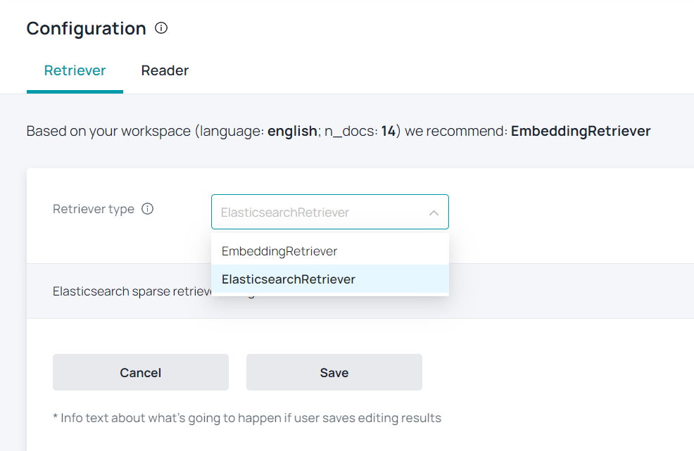
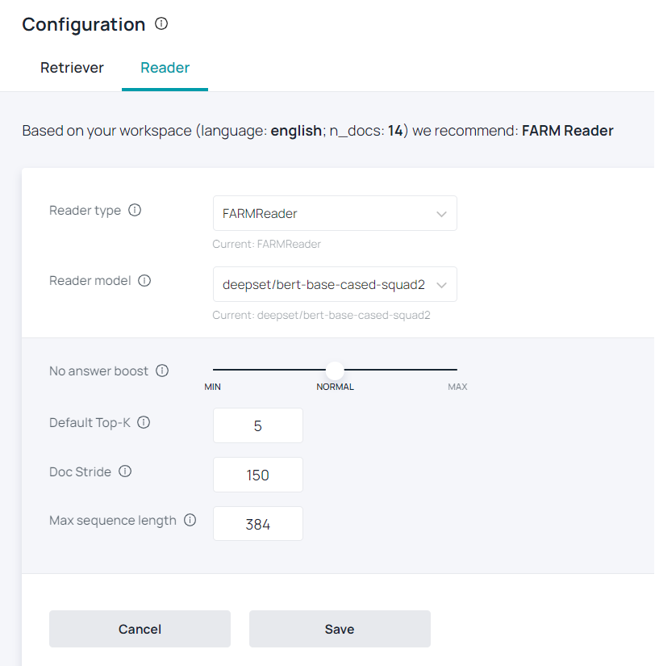

# Configure Model

## Retriever

The Retriever is a lightweight filter that can quickly go through the full document store and pass a set of candidate documents to the Reader. It is an tool for sifting out the obvious negative cases, saving the Reader from doing more work than it needs to and speeding up the querying process.

You can configure the Haystack Hub Retriever either by clicking on **Configuration** in the menu or by choosing **Configure Model** on the Dashboard. Currently, we are only supporting an **ElasticsearchRetriever**. In the future, you can switch between different retrievers by using the dropdown. For more information about the retriever click [here](/docs/latest/retrievermd#BM25-Recommended).

The Top-K configures how many documents are returned per query.

## Reader

The Reader, also known as Open-Domain QA systems in Machine Learning speak, is the core component that enables Haystack to find the answers that you need. Haystack Hub only supports the **FarmReader** at the moment and two QA models [**deepset/roberta-base-squad2**](https://huggingface.co/deepset/roberta-base-squad2) [**deepset/bert-base-cased-squad2**](https://huggingface.co/deepset/bert-base-cased-squad2). You can switch between the models by using the dropdown. Furthermore, you can fine tune your Reader with the following options:

* **No answer boost**: How much the noanswer logit is boosted/increased. If set to None (default), disables returning "no answer" predictions. If a negative number, there is a lower chance of "no answer" being predicted. If a positive number, there is an increased chance of "no answer"
* **Default Top-K**: How many answers to extract for each candidate doc that is coming from the retriever.
* **Doc Stride**: Length of striding window for splitting long texts (used if len(text) > max_seq_len).
* **Max sequence length**: Max sequence length of one input text for the model.

You will find more details regarding the Reader [here](/docs/latest/readermd).

## What’s next

We explained in this section how to configure the Reader and Retriever in Haystack Hub. If you want to know more about the pro and cons as well as the functionality, we recommend the following docs:

* [Retriever Usage](/docs/latest/retrievermd)
* [Reader Usage](/docs/latest/readermd)
* [XLM-RoBERTa](https://medium.com/deepset-ai/xlm-roberta-the-multilingual-alternative-for-non-english-nlp-cf0b889ccbbf)
* [Benchmarking of different models](/bm/benchmarks)

