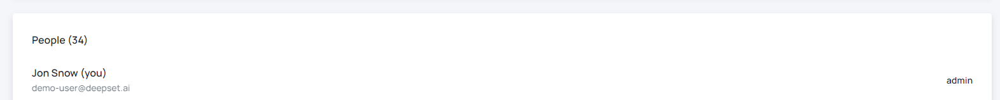

# Configure Workspace

Your organization have one workspace which needs to be configured before you can start to search.

## Workspace Languages

Every workspace has one or multiple languages. For now, Haystack Hub only supports **English** and **German**. The selected language defines which languages are allowed for your documents. E.g. if you select **English** you can only upload documents written in English. Haystack Hub will support you and check the language of the documents during the [upload process](http://localhost:8000/docs_hub/upload_documentsmd).

## Workspace Members

You can invite people to your organization during the [sign up](/docs_hub/get_startedmd#Haystack-Hub-Free-Trail) process or in the [user settings](/docs_hub/user_settingsmd#Organization). Currently, all users are connected to the default workspace.

