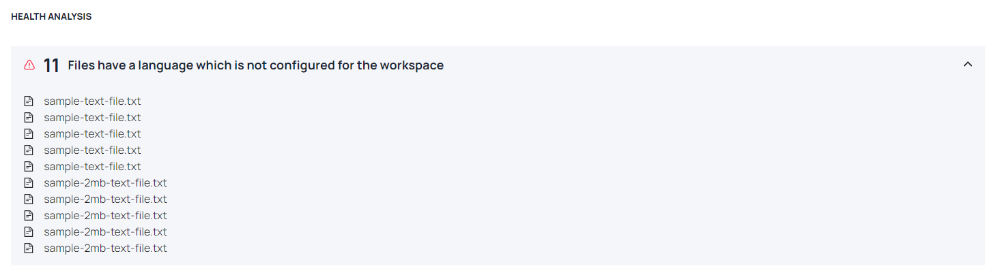
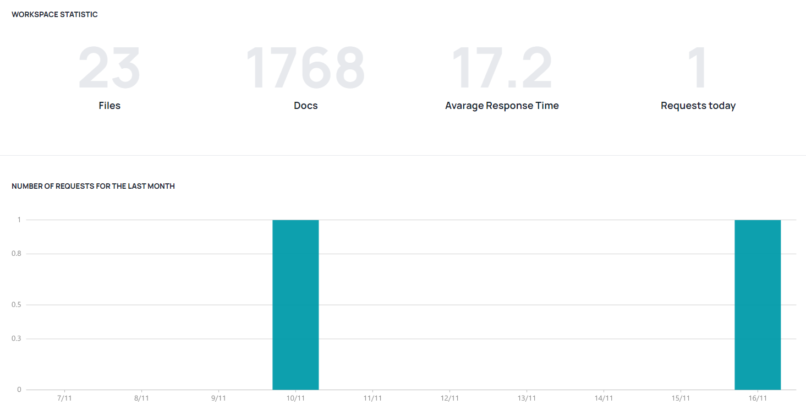
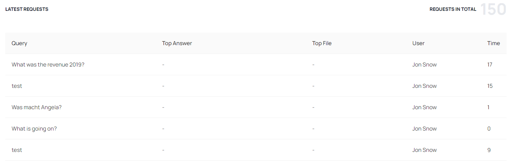

# Dashboard

## Getting Started

Haystack Hub supports you with your first steps. You will find a detailed description [here](/docs_hub/get_started_hubmd#First-steps)

## Health Analysis

Haystack Hub checks if your uploaded files match the configured workspace language. You find a list of warnings in [Documents view](/docs_hub/upload_documents_hubmd#Warnings) and on the dashboard in the section **Health Analysis**. In order to use the files in your search, you need to resolve the issues.

## Workspace Statistic

Haystack Hub provides statistics regarding your search. This helps to analyze the performance of your workspace. Moreover, you can make sure to react before you reach the limit of your subscription level.

### Number of Requests for the Last Month

The section workspace statistics consist of 4 key figures which summarizes the most important numbers:

* **Number of files** which you uploaded to your workspace
* **Number of docs** after preprocessing
* **Average Response Time** of your requests 
* **Number of Requests today** within your workspace

These figures help you to keep track of your workspace performance and subscription boundaries.

### Latest Requests

The table **Latest Requests** shows the last 5 requests within your workspace. This way, the user has an overview about the workspace search history and can come back to former requests.

