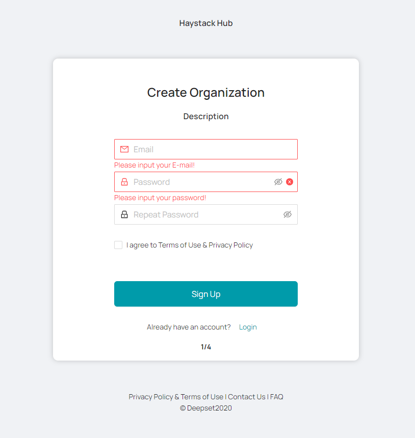
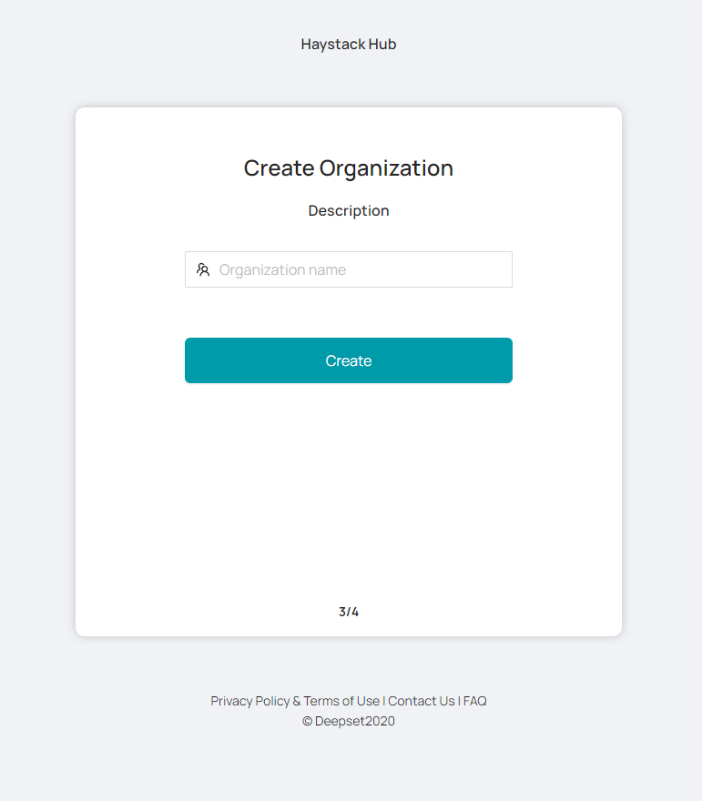
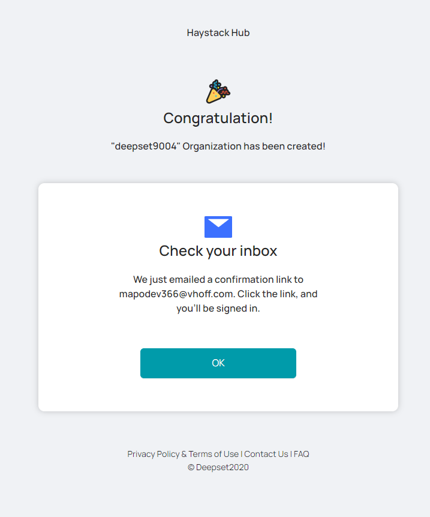
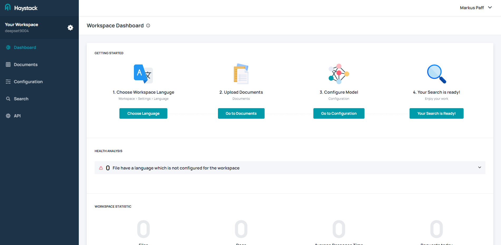
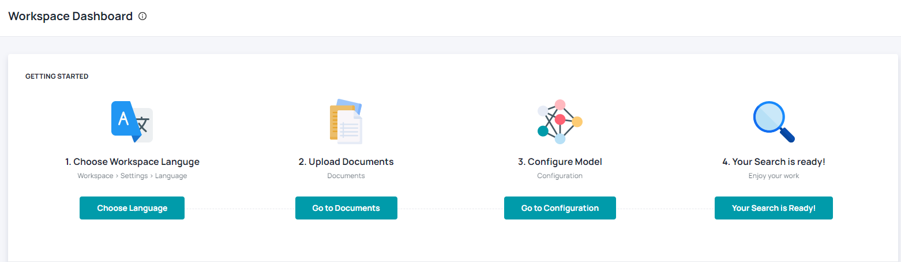
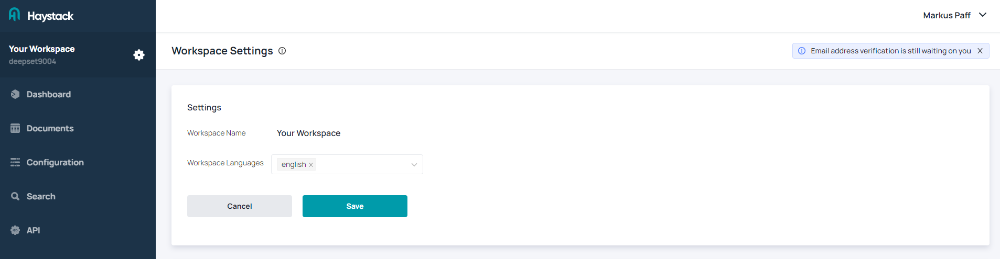

# Sign up for a Free Haystack Hub Trial

To help you get to know [**Haystack Hub**](https://app.haystack-hub.com/), you can try it out for free in the **Starter** version for **14 days**. You will find more information regarding the pricing [here](https://haystack.deepset.ai/pricing/pricing/).

You can cancle your subscription at any time via email (<haystack@deepset.ai>).

This article describes how to sign up for a subscription.

## Haystack Hub Free Trail

1. Click [Try Haystack Hub](https://app.haystack-hub.com/signup/step-1) here or at the top right of this page.
2. You will be forwared to the **Haystack Hub Sign Up** page.

3. Enter your email and a password. Your password must be 10 characters, at least one uppercase letter, one lowercase letter, one number and one special character. Moreover, you need to agree with our [Terms of Use]() and [Privacy Policy](). Click **Sign Up** to go on.

4. Enter your personal details on the next page and click **Continue**.

5. Create an **Organization** by entering a name and choose **Create**.

6. Invite people to your organization by entering their email address. You can invite multiple people at once by choosing **Add another**. This way, a new input field will appear and you enter another email address. They will get an invitation email to your workspace after choosing **Invite people**. You can skip this step by clicking **Skip for now**.

7. You will receive an email with an confirmation link. This link will verify your email address and forward you to the [Haystack Hub Login](https://app.haystack-hub.com/) page. 

8. Enjoy using **Haystack Hub**.

## First steps

There are 4 easy steps to start with **Haystack Hub**. As soon as you are [logged in](https://app.haystack-hub.com/), you will see a **GETTING STARTED** section on your dashboard, which will guide you through the first steps.

### Step 1 Choose Workspace Languge

Click **Choose Language** in the **Getting Started** section or choose the **Gear Button** next to **Your Worksapce**. You will be redirected to **Workspace Settings**. By default, Haystack Hub comes with **English** as workspace language. You can selected mutlitple language for your workspace. The selected languages define which kind of documents Haystack Hub can work with. the language of the documents you want to search need to have the selected language. Currently, **English** and **German** is supported.

### Step 2 Upload Documents

### Step 3 Configure Model

### Step 4 Your Search is ready!