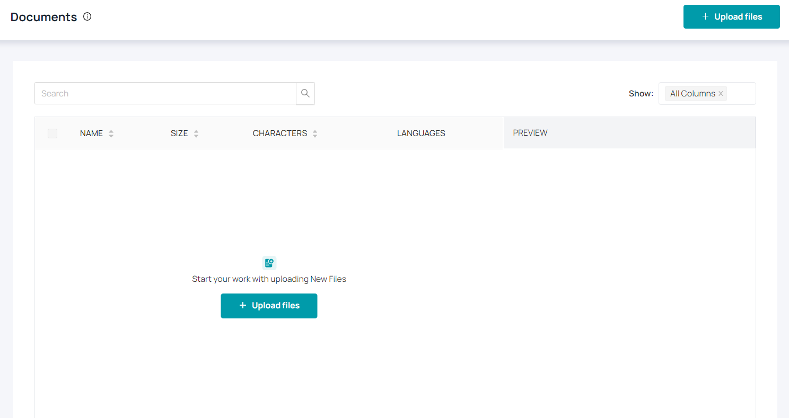
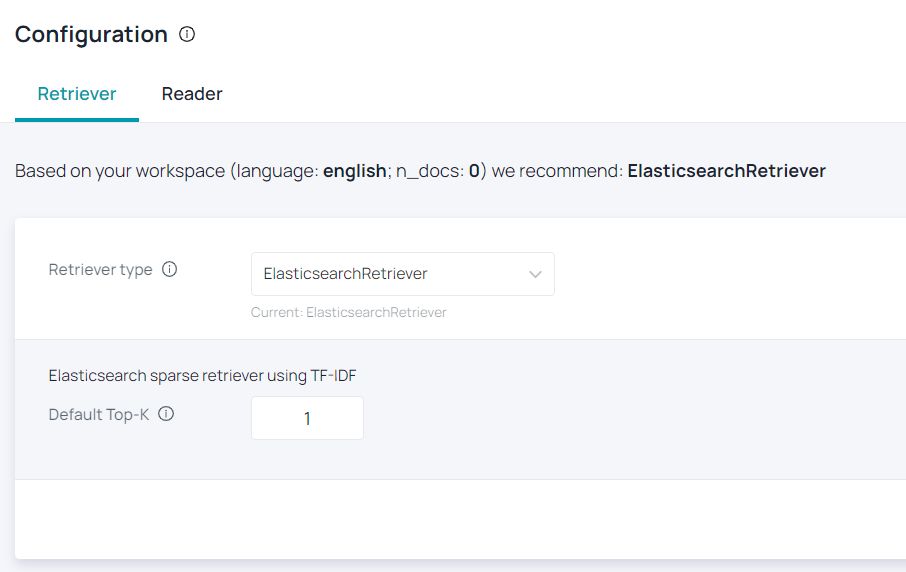
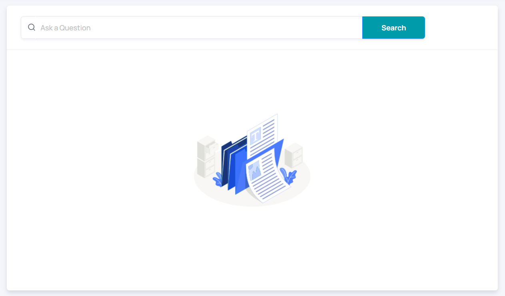

# Quickstart

This section describes the first steps with **Haystack Hub**. You will find the **sign up** process [here](/docs_hub/signup_free_hubmd) and a description of our **subscriptions** levels [here](/docs_hub/signup_hubmd).

## First steps

There are 4 easy steps to start with **Haystack Hub**. As soon as you are [logged in](https://app.haystack-hub.com/), you will see a **GETTING STARTED** section on your dashboard, which will guide you through the first steps.

### Step 1: Choose Workspace Language

Click **Choose Language** in the **Getting Started** section or choose the **Gear Button** next to **Your Workspace**. You will be redirected to **Workspace Settings**. By default, Haystack Hub comes with **English** as workspace language. You can select mutltiple language for your workspace. The selected languages define which kind of documents Haystack Hub can work with. The language of the documents you want to search need to have the selected language. Currently, **English** and **German** are supported. For more information click [here](/docs_hub/conf_workspace_hubmd).

### Step 2: Upload Documents

Go back to your [dashboard](https://app.haystack-hub.com/dashboard) and choose **Go to Documents** or click **Documents** on the left in order to upload documents which you want to search. Choose **Upload Files** and follow the process. Make sure that you configured the correct language for your files in [Step 1](/docs_hub/get_started_hubmd#Step-1-Choose-Workspace-Languge). We support **pdf** and **txt** files, for now in Haystack Hub. You will find a detailed description of the upload process [here](/docs_hub/upload_documents_hubmd).

### Step 3: Configure Model

Starting from your [dashboard](https://app.haystack-hub.com/dashboard) you can choose **Go to Configuration** or click **Configuration** on the left. Haystack Hub comes with a default configuration for **Retriever** and **Reader**. If you want to learn more about the model configuration click [here](/docs_hub/conf_model_hubmd).

### Step 4: Your Search is ready!

If you followed **Step 1** to **Step 2** successfully, your search is ready. Start to ask questions and click **Search**. Haystack will list the most relevant answers depending on your model configuration. You can find more details [here](/docs_hub/search_hubmd).

