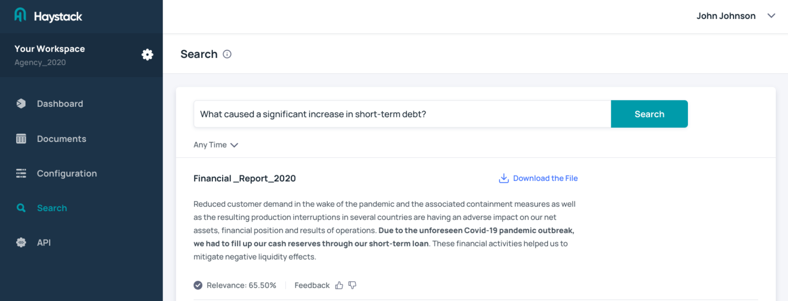

# What is Haystack Hub?

We are providing Haystack as [**Open source framework**](/docs/intromd) to scale QA models to large collections of documents and Haystack Hub as **Enterprise-ready** subscription model with full service to enable neural search.

**Everything in Open Source plus**
* Web interface for configuring and operating your QA system
* API access
* Search UI for end users
* Support
  

## Use cases

### Financial Governance

Gaining insights into financial data of multiple companies within a market. Analysis mainly focuses on reducing risks e.g. credit decisions.

* Faster and efficient insights
* Comprehensive insights into the full data and therefore significantly less risk in the analysis

### Knowledge Base Search

Finding relevant information in infromation portals or wikis.

* Direct resolution of tickets
* Increased customer satisfaction
* More efficient onboarding and knowledge sharing in enterprises

### Market & Competitor Intelligence

Analyzing market trends and monitoring of competitive strategy.

* Comprehensive analysis of complete data sets
* Higher efficiency in research leaving more time for humans to create synthesis
