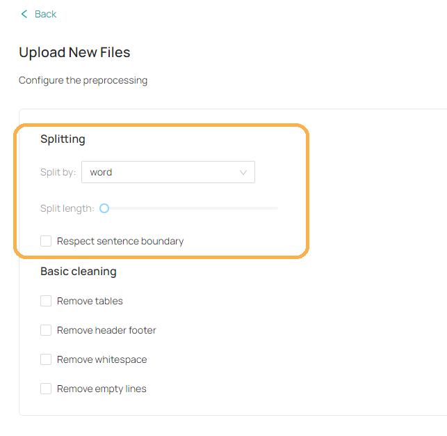
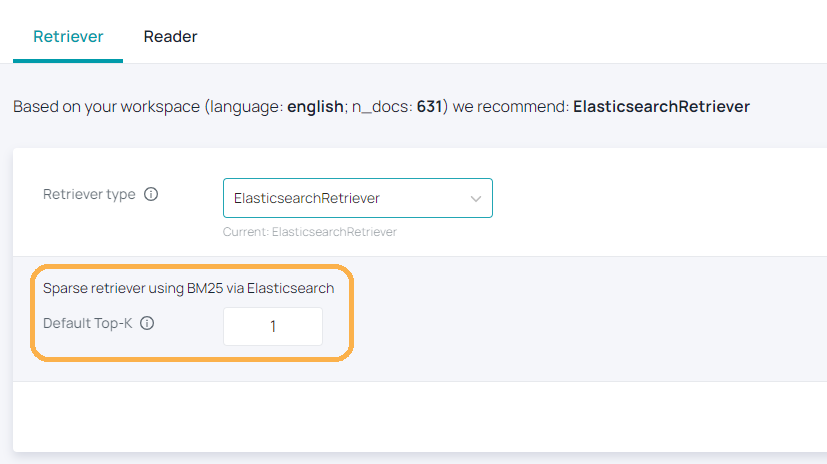
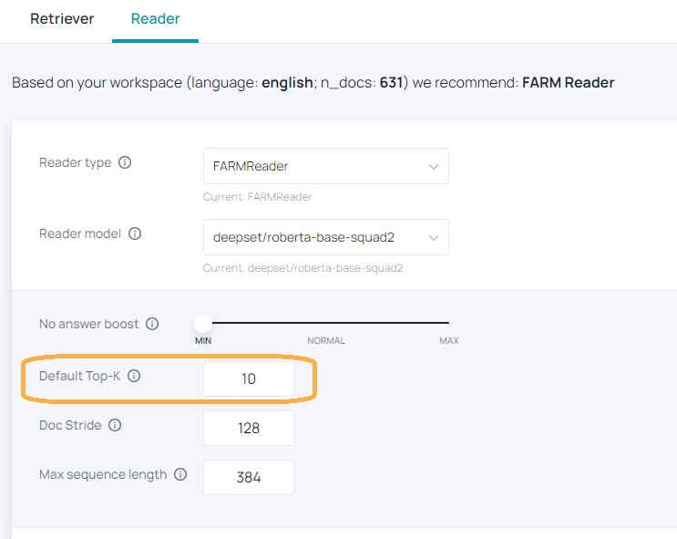

# Optimize Your Search

We have several options to configure your workspace. Most of these options have an influence on your search results and the performance. If you do not get useful answers, we recommend to look into the following steps or contact our support via the chat or via info@haystack-hub.com.

## Preprocessing

### Document Length

Document length has a very direct impact on the speed of the Reader, which is why we recommend using the [**Preprocessor** configuration](/docs_hub/upload_documentsmd#Preprocessing) to clean and split your documents. If you halve the length of your documents, you will halve the workload placed onto your Reader.

At the moment, we only support sparse retrievers (ElasticsearchRetriever). For them, very long documents pose a challenge since the signal of the relevant section of text can get washed out by the rest of the document. We would recommend making sure that documents are no longer than 10,000 words.

### Respecting Sentence Boundaries

When splitting documents, it is generally not a good idea to let document boundaries fall in the middle of sentences. Doing so means that each document will contain incomplete sentence fragments which maybe be hard for both retriever and reader to interpret. It is therefore recommended to mark the checkbox **Respect sentence boundary** when initializing your Preprocessor.

## Retriever and Reader Configuration

The **Top-K** parameter in both the [**Retriever**](/configuration/retriever) and [**Reader**](/configuration/reader) determine how many results they return. More specifically, Retriever Top-K dictates how many retrieved documents are passed on to the next stage, while Reader Top-K determines how many answer candidates to show.

In our experiments, we have found that Retriever **Top-K=10** gives decent overall performance and so we have set this as the default in Haystack Hub.

The choice of Retriever Top-K is a trade-off between speed and accuracy, especially when there is a Reader in the pipeline. Setting it higher means passing more documents to the Reader, thus reducing the chance that the answer-containing passage is missed. However, passing more documents to the Reader will create a larger workload for the component and might cause a timeout.

These parameters can easily be tweaked as follows:

