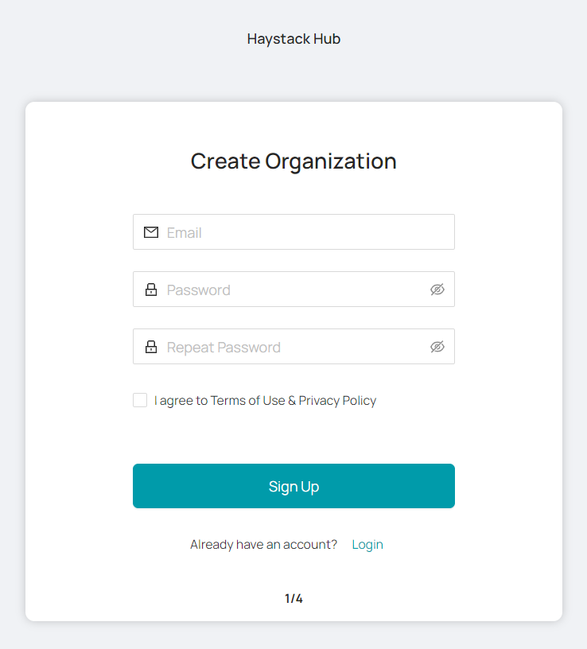
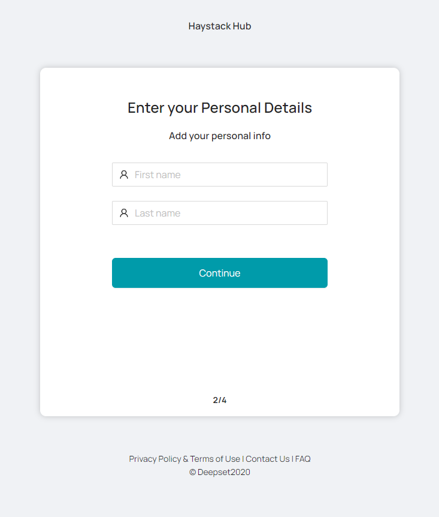
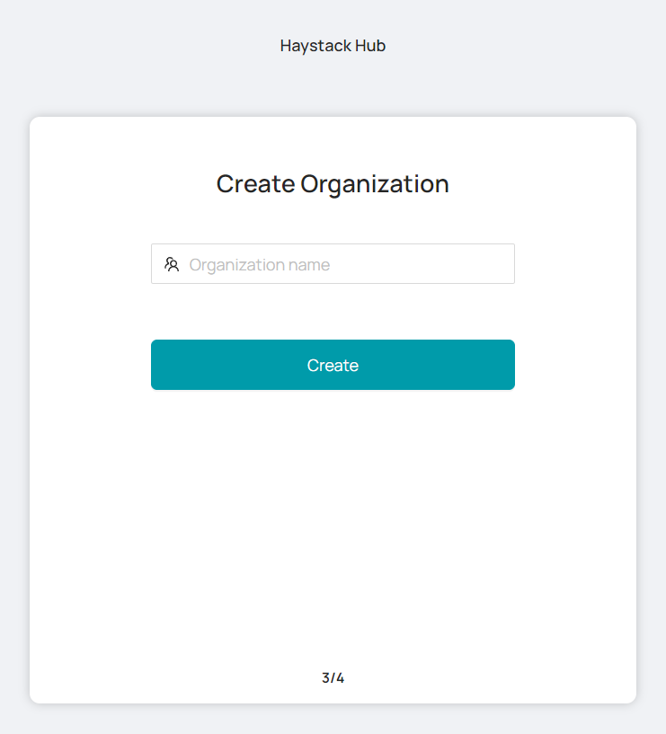
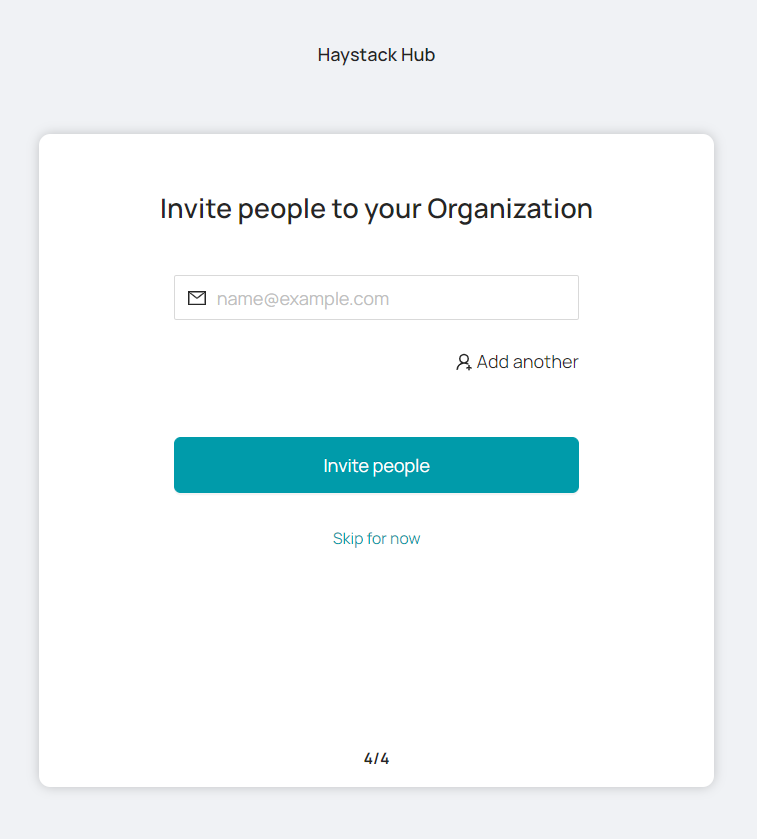
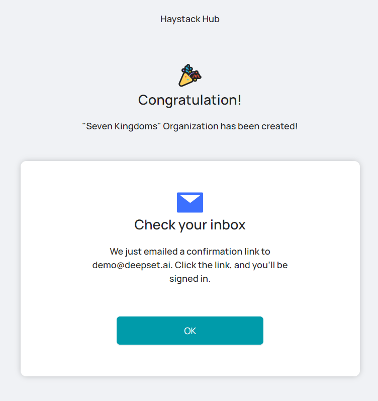
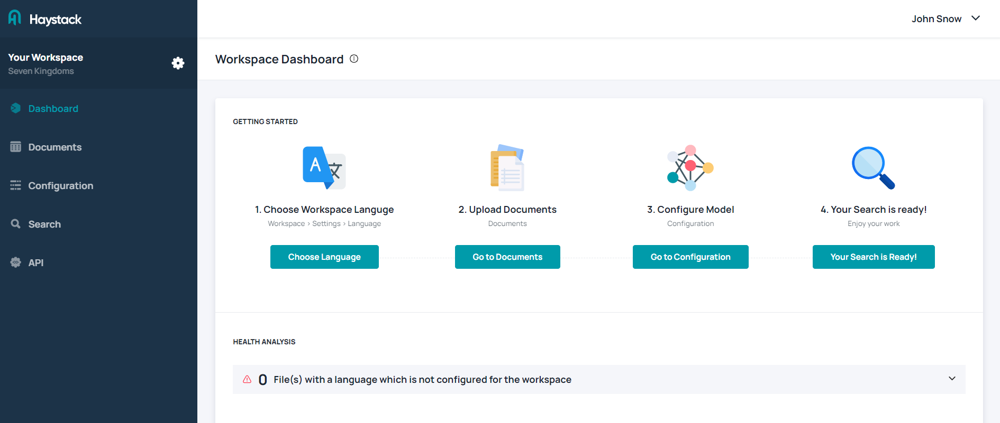

# Sign up for a Free Haystack Hub Trial

To help you get to know [**Haystack Hub**](https://app.haystack-hub.com/), you can try it out for free in the **Starter** version for **14 days**. You will find more information regarding the pricing [here](https://haystack.deepset.ai/pricing/pricing/).

You can cancel your subscription at any time via email (<info@haystack-hub.com>).

This article describes how to sign up for a subscription.

## Haystack Hub Free Trail

1. Click [Try Haystack Hub](https://app.haystack-hub.com/signup/step-1) here or at the top right of this page.
2. You will be forwarded to the **Haystack Hub Sign Up** page.

3. Enter your email and a password. Your password must have 10 characters, at least one uppercase letter, one lowercase letter, one number and one special character. Moreover, you need to agree with our [Terms of Use]() and [Privacy Policy](). Click **Sign Up** to go on.

4. Enter your personal details on the next page and click **Continue**.

5. Create an **Organization** by entering a name and choose **Create**.

6. Invite people to your organization by entering their email address. You can invite multiple people at once by choosing **Add another**. This way, a new input field will appear and you enter another email address. They will get an invitation email to your workspace after choosing **Invite people**. You can skip this step by clicking **Skip for now**.

7. You will receive an email with a confirmation link. Clicking this link will verify your email address and forward you to the [Haystack Hub Login](https://app.haystack-hub.com/) page. 

8. Enjoy using **Haystack Hub**. To get started check out the section [**Quickstart**](/docs_hub/get_started_hubmd)

