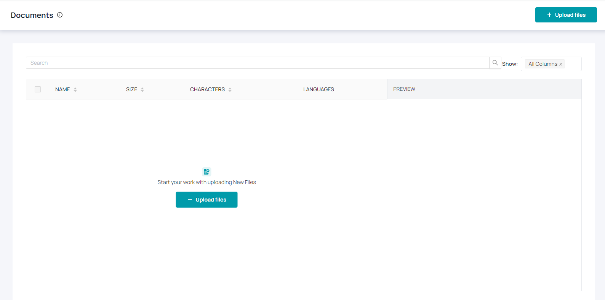
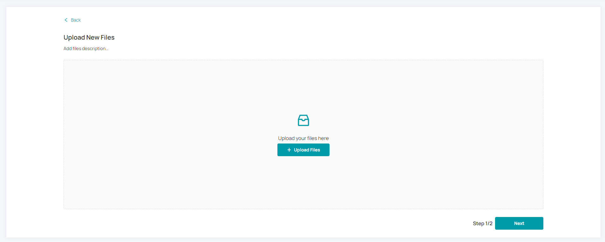
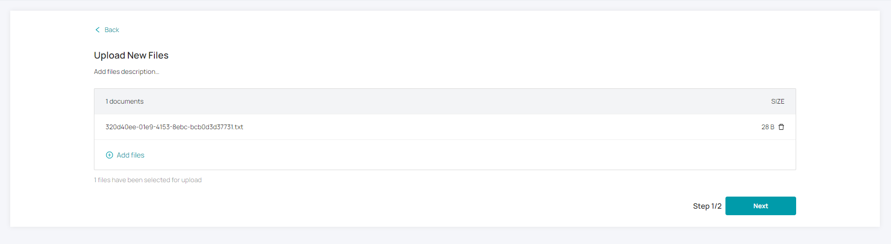
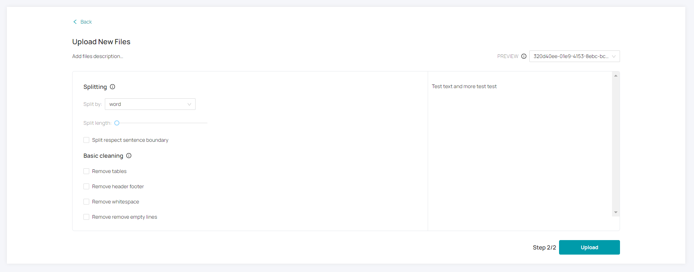
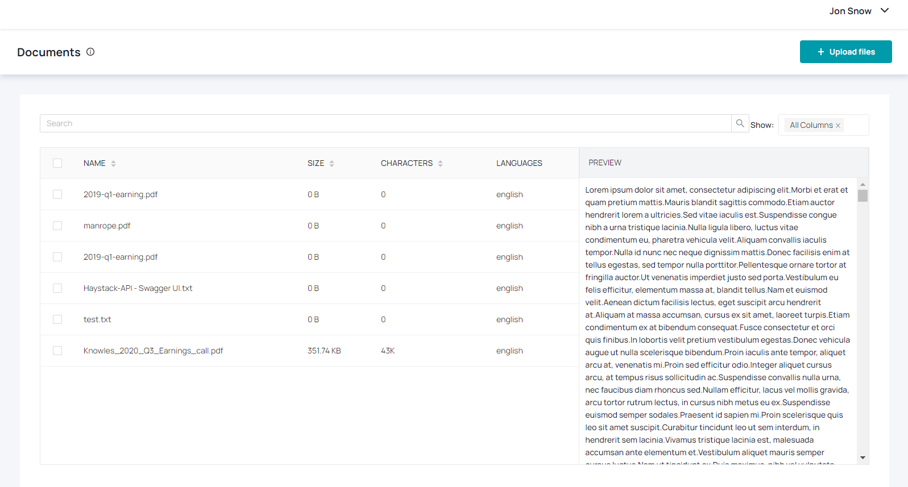

# Upload Documents

In Haystack Hub, the user can upload documents which they would like to search. If you click **Documents** in the menu on the left or on the dashboard **Go to Documents** in the **Getting Started** section, you will be redirected to the following page. This page will be empty if you enter it the first time. 

In order to start your search, you need to upload documents. You can start the workflow by clicking on **+ Upload files**. It will forward you to the next page. You can drag and drop files here or open a new window to load them from your file system. Haystack Hub supports the **pdf** and **txt** formats.

After uploading the files, you can review them and upload even more files by clicking **Add files**. Select **Next** to start with the configuration of your preprocessing.

The preprocessing is separated into two parts **Splitting** and **Basic cleaning**. Please check the section [preprocessing](/docs_hub/upload_documents_hubmd#Preprocessing) for more details. Select **Upload** for uploading your documents.

After you uploaded your documents and refreshed the page, you will see the uploaded documents. If you select one file, you will see a preview of the cleaned file on the right side. In order to delete files, you need to select them via the checkbox. A button **Delete X files** will appear. If you click the button, Haystack Hub will delete the selected files.

## Preprocessing

The preprocessing is separated into two parts **Splitting** and **Basic cleaning**. 

**Splitting**

* **Split by** determines what unit the document is split by: **word**, **sentence** or **passage**. 
* **Split length** sets a maximum number of **word**, **sentence** or **passage** units per output document.
* **Split respect sentence boundary** ensures that document boundaries do not fall in the middle of sentences.

The Splitting of documents has impact on the Haystack Hub performance. Please check [here](/docs/latest/preprocessingmd#Impact-of-Document-Splitting) for more details.

**Basic cleaning**

* **Remove talbes** will remove tables from the documents.
* **Remove haeder footer** will remove any long header or footer texts that are repeated on each page.
* **Remove whitespaces** will remove any whitespace at the beginning or end of each line in the text.
* **Remove empty lines** will normalize 3 or more consecutive empty lines to be just a two empty lines.

On the right side of the preprocessing view you will find a preview in order to check the impact of your changes. You can change between your uploaded file via the dropdown above the preview.

## Warnings

You can configure one or multiple languages for your workspace ([more details](/docs_hub/conf_workspace_hubmd#Workspace-Languages)). Haystack Hub will check for each file, if the language matches to your configuration. For all files, which do not have these languages, Haystack Hub will show a warning. 

## What’s next

The preprocessing has a lot of impact on the performance of the QA System. If you want to know more, what do expect, please look into these resources:

* [Haystack preprocessing](/docs/latest/preprocessingmd)

