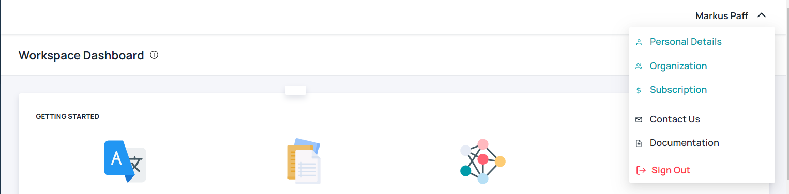
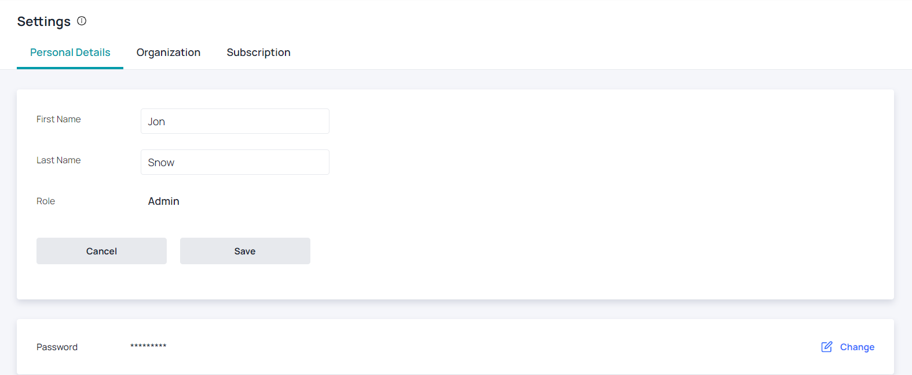
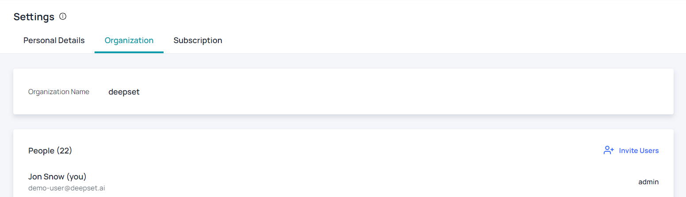
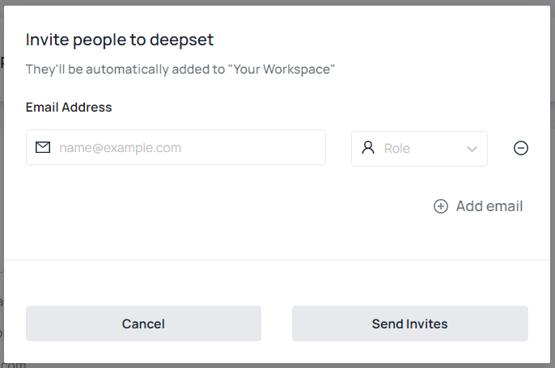
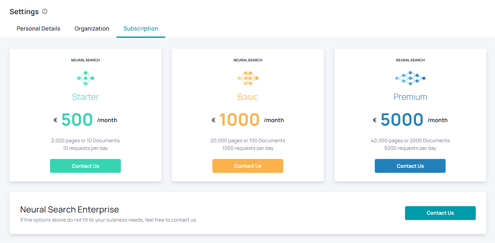

# User Settings

The user can update and change his user settings. He can enter the menu by clicking on his name on the top right. This will open a dropdown with different options. The first three options are going to be described in the following sections. Furthermore, he can choose between the following options:

* **Contact Us**: The user will be forwarded to a [contact formular](https://haystack.deepset.ai/contact/contact). If you have any questions regarding Haystack, feel free to contact our support team there.
* **Documentation**: The user will be forwarded to the [Haystack Hub website](https://haystack.deepset.ai/docs_hub/get_startedmd) where he can find the documentation for Haystack.
* **Sign Out**: The user will be signed out from Haystack Hub and will be forwarded to the [login page](https://app.haystack-hub).

## Personal Details

The user can change his personal details like **First Name**, **Last name** and **Password**. The role of the user is shown, but cannot be changed. This can only be done by the admin in the **Organization** tab. 

## Organization

The organization consists of a name, which is unique and not changeable, and members. The admin can add more people to the organization. There are two roles **Admin** and **User**. The admin can configure the whole account, search and invite new people while the user can just configure the workspace and search within it.

Inviting people is done via a popup. The admin needs to specify the email address and a role for the user. The user will receive an email with an invitation link. The new user can sign up to Haystack Hub and will be connected to the organization.

## Subscription

Haystack Hub provides 4 subscription levels, which are defined by pages of documents and requests per day. For more information, please feel free to contact us via our [Contact Form](https://haystack.deepset.ai/contact/contact) or info@haystack-hub.com.

